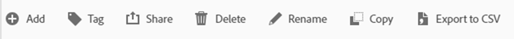

# Låsa upp analytisk information och utnyttja kommentarerna

Datakomponenten för anteckningar är en av de enklaste, men på lång sikt en av de mest tidsbesparande funktionerna i Adobe Analysis Workspace. Till skillnad från andra funktioner i Workspace fungerar det som ett berättande historiskt minne för dig och dina andra Workspace-användare.

Anteckningar är kort beskrivningar som kan läggas in i data som trendas i Adobe Workspace. Anteckningar ger kontext till alla som använder Analysis Workspace för att förstå företagets datahistorik, hjälper till att analysera prestandan snabbare och ger alla rapporter en välanpassad känsla.

## Användningsfall

Det finns flera situationer där anteckningar är särskilt användbara:

- **Externa (toppar och dalar)** - Om du vet orsaken till de största topparna och dalarna med trenddata högerklickar du snabbt på den tidigare datapunkten och väljer Anteckna markering för att dela den kunskapen med alla.

- **Större marknadsföringskampanjer och tester** - som marknadsföringskampanjer och tester (A/B, multivariat osv.) kan direkt påverka trafik och prestanda. Det är en enkel fördel för alla att dokumentera tidsramen för dessa kampanjer och tester i Anteckningar.

- **Externa faktorer och händelser** - allt från större engångshändelser, till konkurrentåtgärder, nya produktreleaser och relevanta globala eller inhemska händelser, se till att lägga till eventuella datarelevanta externa faktorer till anteckningarna.

- **Mellanrum och fel** - ni bör använda larmfunktionen för att varna er för eventuella datainsamlingsproblem, men även de mest erfarna teamen råkar tyvärr ut för en viss form av datainsamlingsfel eller tillfälliga luckor emellanåt. Anteckningar är ett bra sätt att minimera effekten genom att informera användarna om att data saknas eller är ofullständiga.

## Instruktioner

Att skapa och redigera anteckningar är intuitivt och nästan självförklarande. Högerklicka på en datapunkt inom en datumtrendvisualisering eller frihandstabell och välj Anteckna markering för att skapa en anteckning eller använd huvudnavigeringen till Komponenter > Anteckningar för att skapa och redigera anteckningar.

{width="70%"}{width="30%"}

Mer information om hur anteckningar fungerar finns i [videosjälvstudiekurs om Experience League](https://experienceleague.adobe.com/en/docs/analytics-learn/tutorials/analysis-workspace/navigating-workspace-projects/annotations-in-analysis-workspace).

## Tips och tricks för att komma igång

Här är slutligen några användbara tips som hjälper dig att börja använda anteckningar direkt.  Genom att använda dessa förslag blir dina kommentarer effektiva, tydliga och informativa för alla användare.

- **Färgkodning** - Med funktionen Anteckningar kan du välja bland en mängd olika färger som visas i arbetsyteprojekten för att hjälpa dig att skilja mellan olika typer av anteckningar. Om du mäter flera olika webbplatser eller appar kan du välja olika färger för var och en av dem. Eller kanske en annan färg för varje kategori av anteckningar.

- **Titelmärkning** - Ett annat sätt att ge användarna enkla visuella indikeringar om en anteckning är att märka kommentarens titel. På samma sätt som färgkodning kan du välja olika etiketter beroende på hur data struktureras i organisationen, t.ex. efter kanal eller namn (t.ex. WEB, APP eller ALL)

- **Omfång** - När du skapar en anteckning har du tillgång till alla mått, mätvärden och avgränsare för att kunna visa anteckningar i rätt sammanhang. Vissa anteckningar är bara relevanta för vissa dimensioner eller mätvärden, så du kan begränsa när en anteckning visas till motsvarande mått eller mätvärden.

- **Spara som** - När du har skapat en eller två anteckningar kan du återanvända dem som mallar för att skapa nya anteckningar genom att använda det tidsbesparande alternativet &quot;Spara som&quot;.

- **Anteckningshanteraren** - Använd huvudnavigeringen till &quot;Komponenter > Anteckningar&quot; för att nå Anteckningshanteraren där du hittar mer omfattande funktionalitet att skapa och särskilt redigera anteckningar.

- **Behörigheter -** Om du inte kan skapa anteckningar kontaktar du administratören som kan tillåta&quot;Skapa anteckning&quot; i Admin Console.

Detaljerad dokumentation finns på [Översikt över anteckningar](https://experienceleague.adobe.com/en/docs/analytics/analyze/analysis-workspace/components/annotations/overview) och omgivande artiklar.

## Författare

Det här dokumentet har skrivits av:

Thomas Edward Buckley, Manager Data Warehouse &amp; Business Intelligence på Miles &amp; More (Lufthansa Group)

