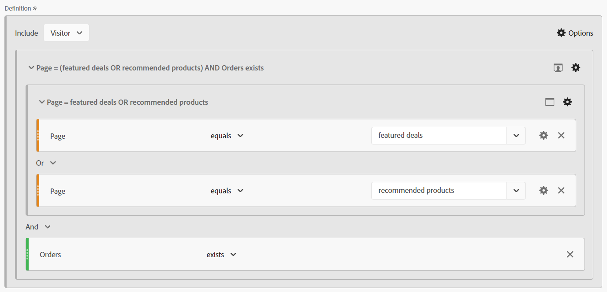
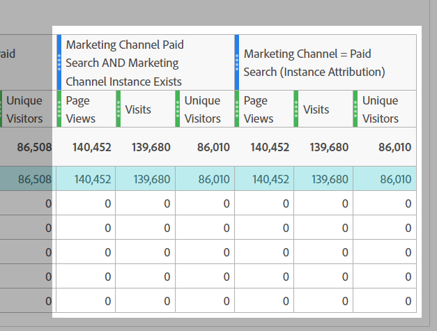

# Magin bakom gardinen: Komplexa segment: exkluderar, behållare och attribuering

_Upptäck krånglet med komplex datasegmentering, utforska exkluderingar, behållare och attribueringsmodeller. Precis som en magiker i handen ger bemanningen av dessa tekniker analytiker möjlighet att utföra datagisk och omvandla insikter med precision och finess._

Gardinerna är öppna. Scenen är inte en Las Vegas-magisk handling, men vi kan göra några fantastiska trick när vi bygger våra segment.

I den här modulen ska vi ta upp:

- Exkludera logik
- Använda behållare
- Attributionsmodell

## Inkludera jämfört med exkludera

Som standard startar alla behållare som typen **include**, vilket innebär att de returnerar data som matchar villkoren. Du kan också ändra segmentet, eller behållare i segmenten, till typen **exclude**, så att du kan avvisa vissa villkor.

Medan en magiker kan hitta ditt kort på däck är det fantastiskt när magikern kan få resten av däcket att inte existera. På samma sätt vill vi att oönskade data ska tas bort från datauppsättningen när vi utesluter segment.

Du kanske sitter där och tänker &quot;OK, men jag har redan alternativen &quot;Är inte lika&quot; och &quot;Innehåller inte&quot;, så ska inte det täcka mig?&quot; Tyvärr är svaret på det nej ... och det handlar inte bara om att kunna utesluta grupper av logik, i stället för ett enda element. Även när du arbetar med en enda komponent måste du ofta använda *excludes* för att uppnå ditt mål.

- **Innehåller inte / Är inte lika med** - Är bara hur det låter, matchar objekt som inte innehåller en viss sträng
- **Exkludera: Värdet innehåller / är lika med** - Detta *exkluderar* objekt som matchar strängen

Vid första anblicken låter båda de samma... och vid **hit**-nivåsegment/behållare skulle du ha rätt eftersom de utför samma åtgärd. När du använder omfattningen **besök** eller **besökare** får du dock väldigt olika resultat.

**Figur 1: Innehåller inte/är inte lika med - Träff-omfång**

*Observera att varje träff returnerar ett true- eller false-värde och att dessa värden inverteras mellan gör det inte och exkluderar.*

- Innebär att&quot;Värde&quot; inte innehåller&quot;Exempel&quot; (ja). Därför returneras true och den träffen tas med. På samma sätt innehåller&quot;Exempel&quot; inte&quot;Exempel&quot; (nej, den innehåller den). Därför returneras false och den träffen tas inte med. Returnera i stort sett alla data som returnerar ett sant resultat.
- Innebär &quot;Värde&quot; att det innehåller &quot;Exempel&quot; (nej). Därför returneras false och träffen utesluts inte. På samma sätt innehåller &quot;Exempel&quot; (ja), därför returneras true och träffen utelämnas. Returnera data som **inte** har i princip ett sant resultat, eller returnera data som är falska enligt dina kriterier.
- Du kan se att båda uppsättningarna med logik returnerar samma datauppsättning på **träff** -nivån.

**Figur 2: Innehåller inte/är inte lika - Besök omfång**

*Precis som ovan utvärderas varje träff i **besök**med samma sant/falskt. Datauppsättningen som returneras är dock den för hela besöket.*

- För varje träff innehåller&quot;Värde&quot; inte&quot;Exempel&quot; (ja), därför returneras true. På samma sätt innehåller&quot;Exempel&quot; inte&quot;Exempel&quot; (nej, det innehåller det) och returnerar därför false.
   - Om **någon** träffar i besöket returnerar **true** returneras **hela besöket**.*
   - Om besöket helt består av träffar som innehöll&quot;Exempel&quot; returneras inga träffar som true, och därför returneras **inte** i din datauppsättning.
- För varje träff innehåller &quot;Example&quot; (yes) och returnerar därför true
   - Om **en träff** returnerar **true** kommer hela besöket att **exkluderas**
   - Om **alla träffar** i besöket returnerar **false** returneras besöket i din datauppsättning
- Nu ser ni var logiken börjar spridas. I exemplet ovan finns det tre olika besök:
   - När du använder &quot;Innehåller inte/är lika med&quot; returneras **två av de tre** besöken.
   - När du använder Exkludera innehåller/är lika med **returneras bara en** av dessa besök

**Figur 3: Innehåller inte/är inte lika - Besök omfång**

*Precis som ovan utvärderas varje träff som görs av **besökaren**med samma sanna/falska logik. Men nu tittar vi på alla träffar som besökaren har gjort i alla besök (inom det valda datumintervallet).*

- För varje träff innehåller&quot;Värde&quot; inte&quot;Exempel&quot; (ja), därför returneras true. På samma sätt innehåller&quot;Exempel&quot; inte&quot;Exempel&quot; (nej, det innehåller det) och returnerar därför false.
   - Om **någon**-träff som gjorts av besökaren returnerar **true** returneras **hela besöket**.
   - Om besökaren aldrig gjorde någon träff som innehöll&quot;Exempel&quot; returneras inga träffar som true, och därför returneras **inte** i datauppsättningen.
- För varje träff innehåller &quot;Exempel&quot; (ja) och returnerar alltså &quot;sant&quot;.
   - Om **en träff** returnerar **true** kommer hela besökaren (och senare alla deras besök) att **exkluderas.**
   - Om **alla träffar** i besöket returnerar **false** returneras den besökaren i datauppsättningen, vilket innebär att besökare som inte gjorde X returneras.
- Detta är en förlängning av besökslogiken, där det finns ännu fler överväganden. I exemplet ovan finns det två olika besökare, med tre besök var:
   - När du använder&quot;Innehåller inte/är lika&quot; returneras **båda** besökarna, liksom alla **tre** av deras besök (motsvarar 2 besökare och totalt 6 besök i dina rapporter)
   - När du använder Exkludera innehåller/är lika med **returneras bara en** av dessa besökare, och endast de tre besök som är kopplade till den besökaren inkluderas (motsvarar 1 besökare och 3 totala besök i dina rapporter)

>[!TIP]
>
>Den här logiken kan vara komplicerad, särskilt när du börjar kapsla in behållare.. det är alltid en bra idé att testa mot kontrollerade exempeldata för att säkerställa att segmentet faktiskt returnerar de data som du tror att det borde.

### Segmentexempel 1: Uteslut besök som gör ett köp

I det här exemplet vill jag rikta in mig på användare som kom till en webbplats och gjorde *inte* ett köp under besöket (i princip vill jag utesluta de besök som utförde en transaktion. Därför lämnar jag besöken som inte slutförde en transaktion)

Som en jämförelse kan vi titta på ett segment som har byggts med&quot;Finns inte&quot;:

Lägg märke till att förhandsgranskningen ger ett helt annat resultat.. i själva verket kommer det här segmentet att returnera 100 % av mina besök, eftersom varje besök har minst en träff som inte inkluderar&quot;ordermätningen&quot;.

Om du vill illustrera detta ytterligare kan du jämföra de två segmenten sida vid sida:

För det första kan du se att vi, trots segmentets *besöksnivå*, kan koppla segmentet med andra mätvärden (som sidvisningar eller unika besökare). Den första uppsättningen kolumner är osegmenterade, så att du snabbt kan se att det enda segmentet (som inte finns) returnerar nästan 100 % av alla data, så är det bara det uteslutna segmentet som gör det vi behöver.

Den mest påfallande kolumnen är beställningarna, som bör vara direkt uppenbart att behållaren &quot;Finns inte&quot; är felaktig eftersom de flesta beställningarna fortfarande returneras.

### Segmentexempel 2: Uteslut besökare som har gjort ett köp inom rapporteringsperioden

I det här exemplet vill jag använda idéerna från det föregående exemplet (där man särskilt tittade på besöksnivån) och utöka det för att hitta besökare som inte har gjort ett köp inom tidsramen för min rapport.

Det här segmentet kommer att se ut ungefär som i ovanstående exempel, nästan identiskt, men segmentets omfång kommer att göra stor skillnad.

Om vi nu jämför besöksomfångssegmentet med besöksomfångssegmentet ovan, kommer du att se att mycket fler data och många fler besökare utesluts, eftersom *besökare som gjorde köp* också hade besök där inga inköp gjordes, och dessa besök exkluderas också eftersom de ingår i besökarens livscykel.

>[!IMPORTANT]
>
>När du tittar på data som omfattar besökare blir undantaget större ju längre tidrapporterna är, eftersom många besökare är lojala och återvänder till webbplatsen (vissa affärsmodeller kommer förstås att ha större effekt än andra)

>[!IMPORTANT]
>
>Skillnaderna mellan besök och besökare kan vara *subtil* (särskilt i dessa exempeldata), men de är unika logik som bör beaktas. Dina data kan vara påfallande annorlunda beroende på din webbplats och dina användarbeteenden.

Det är viktigt att du vet exakt vilka data, eller vilken *artikel*, du försöker berätta med din rapport. Att se till att dina tabeller och visualiseringar tydligt talar om för publiken ***vad*** visas, och att det är viktigt att använda rätt segmentmodell för att kunna göra rätt analys. Informade beslut kan bara fattas på rätt sätt om alla förstår vad de tittar på.

## Använda behållare

Behållare ger oss möjlighet att skapa&quot;sublogik&quot; inom segmentets huvudlogik, och en vanlig missuppfattning är att omfånget måste vara detsamma mellan segmentet och behållaren.. men det gör det inte. Detta ger oss större frihet att skapa specifika scenarier i den större uppsättningen av saker, att bygga ut komplex logik.

Det bästa sättet att tänka på behållare är att tänka sig att varje behållare är en låda och att vi kan stapla lådor (av logik) i en annan låda, i en annan låda.. men till skillnad från fysiska lådor där varje låda måste vara mindre än den yttre lådan, kan vi placera något större inuti om det driver oss att få rätt data tillbaka. Tänk på det som en trollkarhatt, där det omöjliga får plats inuti och vi är datagianer...

### Behållarnas omfattning

Först gör vi en snabb uppdelning av omfattningen *container*. Precis som för *segmentets* omfång har du dina grundläggande **hit**, **besök** och **besökare** omfångsalternativ, men ibland visas även något som kallas **logikgrupp** i stället för besökaren (detta sker endast inom sekventiella segment, och vi täcker dem i nästa artikel).

Du kan lägga till behållare i ditt segment (eller i andra behållare) genom att gå till menyn **options*** (om du kapslar in flera objekt ska du se till att lägga till i rätt block, men som tur är kan du dra och släppa behållare i gränssnittet om du lägger till det på fel plats)

**Figur 1: Lägger till en behållare**

Omfånget för en behållare är oberoende av den överordnade, vilket jag nämnde ovan, dessa *behöver inte* matcha, och beroende på vad du vill returnera kan du behöva rita ut planen för att se det du behöver, åtminstone tills du känner dig bekväm med att visualisera det i ditt huvud.

**Figur 2: Segmentomfång kontra behållaromfång**

>[!NOTE]
>
>Adobe har logik för att förstå giltiga och ogiltiga segment. De ger dig inga alternativ som kan *aldrig* fungera.. så om du ser alternativet att använda en besöksomfångsbehållare i ett träffomfångssegment, betyder det att det är ett giltigt alternativ.

Precis som för bassegment måste du, när du börjar skapa ett komplext segment med kapslade behållare, ha en tydlig uppfattning om ***vilken typ av data du vill returnera***. ***Hur*** tänker du använda dessa data? ***Vilka*** mätvärden planerar du för att para ihop med segmentet?

Dessa frågor hjälper till att avgöra vilket segment som ska vara, det är startpunkten för vilket segment som helst.

Bara för att du planerar att para ihop ett segment med dina unika besökarmått betyder det inte att själva segmentet ska vara besökarnivå ... långt ifrån det. Ett besökarnivåsegment returnerar alla data för en besökare.. Det innebär alla deras besök, alla deras sidvisningar osv.. När en besökare uppfyller dina segmentvillkor kan ditt segment börja returnera data från *förbi* för den här besökaren (så länge som det ligger inom datumintervallet på arbetsytan).

>[!IMPORTANT]
>
>Även om du planerar att para ihop ett segment med det unika besökarmåttet innebär detta *inte* att segmentet automatiskt ska begränsas till besökaromfånget... Denna missuppfattning *kan* skapa uppblåsta och felaktiga resultat.

Så jag har gått igenom en hel del om hur man väljer rätt omfång, men inte gett några exempel eller detaljer som verkligen hjälper dig ... så vi ska titta på det nu med några exempel på hur man använder det. De säger att en trollkarl aldrig avslöjar sina hemligheter, men det är inte riktigt sant. Inom den magiska världen delas teknikerna och &quot;bakom draperiet&quot;-arbetena ofta med kollegor, vilket gör det möjligt för dem att bygga vidare på och förbättra illusionen, och det är vad jag vill göra ... för att öppna dörren för de möjligheter som väntar dig.

### Segmentexempel 3: Vyer på specifika sidor från besökare som nyligen har gjort en beställning (inom rapporteringsperioden)

I det här scenariot vill jag bara returnera en uppsättning specifika sidor som träffats av nyligen köpare (observera att jag fortfarande kan kombinera detta med besök eller unika besökare, trots att segmentet i sig kommer att ha ett HIT-omfång).

Den här typen av scenario är bra att titta på om jag har köpare som tittar på specifika sidor på en webbplats, sidor som kanske inte är uttryckligen kopplade till en viss händelse.

Mitt exempel är att titta på sidorna&quot;Aktuella erbjudanden&quot; och&quot;Rekommenderade produkter&quot;. För närvarande kommer vi att hålla logiken enkel och inte gå in i sekventiell segmentering (åtminstone inte än, men vi kommer att ta itu med mer komplex logik som den i en kommande artikel).

En annan fråga är **varför** drar vi tillbaka efter träffar? Tekniskt sett skulle jag kunna följa med besök eller besökare hit, men jag kanske också vill titta på dessa specifika sidor med **sidvisningar (för den specifika siduppsättningen) per besök** eller **sidvisningar (för den specifika uppsättningen) per besökare**, ger det här omfånget mig flexibilitet att utföra just den här matematiken. Eftersom dessa träffar enkelt kan kombineras med besök eller unika besökare för att avgöra hur många besök eller besökare som ser de här sidorna väljer jag det mest flexibla segmentet som jag kan använda för alla scenarier.

För det första finns det ett enkelt HIT-baserat segment för de specifika sidorna.

Låt oss bygga in komplexiteten:

Jag använder inte bara flera behållare, utan jag blandar omfattningen av dessa. Segmentet som helhet är på HIT-nivå, men jag söker också efter besökare som har gjort en beställning.

Låt oss lägga lite tid på att packa upp det här, eftersom det är mycket som pågår.

För det första, i stället för att visa en daglig uppdelning, visar jag en sidbeskrivning, eftersom jag tror att detta kommer att hjälpa till att illustrera de två segmenten bättre.

<table style="border: 0;">
    <tr>
        <td width="352" style="border: 0;">De första tre kolumnerna (Sidvyer, besök och unika besökare) är osegmenterade och visar därmed alla sidor på webbplatsen. Observera att jag inte tog med order här, eftersom order spåras på en åtgärd och därför inte ingår i siddimensionens omfattning.</td>
        <td style="border: 0;">&lt;img src="assets/segment-example-3/segment3c-comparison-table-detail1.png" width="352"
        </td>
    </tr>
</table>

<table style="border: 0;">
    <tr>
        <td width="352" style="border: 0;">Sedan visar jag resultatet av det enkla segmentet, som bara tittar på <strong>träffar</strong> på de två angivna sidorna. Du kommer att märka att de andra sidorna i uppdelningen blir 0 som förväntat.</td>
        <td style="border: 0;">&lt;img src="assets/segment-example-3/segment3c-comparison-table-detail2.png" width="352"
        </td>
    </tr>
</table>

<table style="border: 0;">
    <tr>
        <td width="352" style="border: 0;">Här är ett litet bonustips, innan jag visar resultatet av det avancerade segmentet använde jag ett annat enkelt segment av"Beställningar finns" (på HIT-nivå-nivå) och parade ihop det med unika besökare. Detta returnerar de totala UV:arna som gjorde beställningar under min rapportperiod, liksom UV:arna som kom till varje sida ... detta bidrar till att illustrera nästa kolumnuppsättning bättre.</td>
        <td style="border: 0;">&lt;img src="assets/segment-example-3/segment3c-comparison-table-detail3.png" width="352"
        </td>
    </tr>
</table>

<table style="border: 0;">
    <tr>
        <td width="352" style="border: 0;">Den sista uppsättningen kolumner staplas med mitt komplexa segment. De övergripande UV:arna med beställningar matchar det enkla"finns beställningar"-segmentet på varje sida, men du kommer att märka att summan är avsevärt annorlunda. Eftersom den här datauppsättningen uttryckligen begränsar datauppsättningen enbart till besökare som har gjort beställningar OCH nått sidorna är jag uttryckligen intresserad av.</td> <td style="border: 0;">
        </td>
    </tr>
</table>

### Exempel på segment 4: Besök som träffar aktuella erbjudanden ELLER rekommenderade produkter OCH gör en beställning inom samma besök

Exemplet ovan visade hur du kan lägga till en större omfångsbehållare (dvs. besökare) inuti en mindre omfångsbehållare (dvs. träff), så det bör inte komma som någon överraskning att du kan lägga till träffbehållare inuti besökaren eller besök omfångssegment.

Med hjälp av några av de sidor vi tittade på tidigare är det nu viktigt att få tillbaka besökarna som råkade hitta på antingen erbjudandena ELLER på den rekommenderade produktsidan OCH gjorde en beställning inom samma besök.

Det här segmentet innehåller alla tre omfången. Den översta nivån i segmentet är besökare, så att ALLA träffar från alla besök returneras för den matchande besökaren. Dessutom har vi lagt till en besöksomfångsbehållare, vilket kommer att säkerställa att besökaren måste ha haft minst ett besök som uppfyller de specifika kriterierna för att göra en beställning OCH efter att ha besökt specifika sidor. Vi har lagt till en behållare för träffområde för själva sidorna, så att vi kan använda ELLER-logik för att söka efter antingen den aktuella sidan ELLER den rekommenderade produktsidan.

Fördelen med det här besöksomfångssegmentet är att det returnerar **ALLA** besök från besökarna som matchar det här villkoret, så det här segmentet är bra om jag vill se beteendena i tidigare besök som leder fram till den här kombinationen och besökarnas åtgärder efter ett sådant scenario.

Här jämför jag träffar på aktuella erbjudanden/rekommenderat innehåll, med befintliga order, med det komplexa segment där både beställningen och en av de angivna sidorna finns vid samma besök. Det komplexa segmentet är där de två första segmenten möts, men eftersom det är besökarens omfång kommer även alla andra besök för dessa besökare att returneras.

## Attributionsmodell

Attributionsmodellering inom en segmentdefinition gäller i huvudsak för dimensioner som inte har träffats, så utkast (som alltid är träffnivå) är inte riktigt en bra kandidat. Era eVars, marknadsföringskanaler osv. är dock de här inställningarna verkligen utformade för.

Innan vi tittar på segmentet bör vi göra en snabb genomgång av hur attribueringsmodellering fungerar i ett enkelt exempel.

Vi har två eVars, en av dem går ut (eVar1) och en av dem går ut 30 dagar (eVar2). För enkelhetens skull ska vi hålla reda på en intern kampanj (icid).

**Besök 1**

- Sida A
   - **eVar1** har inte angetts
   - **eVar2** har inte angetts
- Klicka på Promo Banner med ?icid=promo-banner i URL:en
- Sida B
   - **eVar1** och **eVar2** är inställda på &quot;promo-banner&quot;
   - **Instansen av eVar1** utlöses
   - **Instansen av eVar2** utlöses
- Sida C
   - Både **eVar1** och **eVar2** behåller värdet &quot;promo-banner&quot;
   - Ingen av instansvärdena för eVars genereras eftersom båda eVars-instanserna använder beständiga värden

**Besök 2**

- Sida D
   - **eVar1** har inte angetts till något värde och ingen **instans av eVar1** har utlösts
   - **eVar2** behåller värdet för kampanjbanderollen på grund av 30-dagars förfallodatum
   - **Instansen av eVar2** aktiveras inte eftersom värdet är beständigt och inte har angetts
- Klicka på Side Rail Promotion med ?icid=promo-side-rail i URL:en
- Sida E
   - **eVar1** och **eVar2** är inställda på&quot;promo-side-rail&quot;
   - **Instansen av eVar1** utlöses
   - **Instansen av eVar2** utlöses
- Sida F
   - Både **eVar1** och **eVar2** behåller värdet &quot;promo-side-rail&quot;
   - Ingen av instansvärdena för eVars genereras eftersom båda eVars-instanserna använder beständiga värden

Här är för närvarande det förväntade resultatet av dessa två besök:

<table><tr><th colspan="1" valign="top"></th><th colspan="1" valign="top"></th><th colspan="1" valign="top"><b>Sidvyer</b></th><th colspan="1" valign="top"><b>Besök</b></th><th colspan="1" valign="top"><b>Instans av eVar1</b></th><th colspan="1" valign="top"><b>Instans av eVar2</b></th></tr>
<tr><td colspan="1" valign="top"></td><td colspan="1" valign="top"></td><td colspan="1" valign="top">6</td><td colspan="1" valign="top">2</td><td colspan="1" valign="top">2</td><td colspan="1" valign="top">2</td></tr>
<tr><td colspan="1" rowspan="7" valign="top">Sida</td><td colspan="1" valign="top"></td><td colspan="1" valign="top">6</td><td colspan="1" valign="top">2</td><td colspan="1" valign="top">2</td><td colspan="1" valign="top">2</td></tr>
<tr><td colspan="1" valign="top">Sida A</td><td colspan="1" valign="top">1</td><td colspan="1" valign="top">1</td><td colspan="1" valign="top">0</td><td colspan="1" valign="top">0</td></tr>
<tr><td colspan="1" valign="top">Sida B</td><td colspan="1" valign="top">1</td><td colspan="1" valign="top">1</td><td colspan="1" valign="top">1</td><td colspan="1" valign="top">1</td></tr>
<tr><td colspan="1" valign="top">Sida C</td><td colspan="1" valign="top">1</td><td colspan="1" valign="top">1</td><td colspan="1" valign="top">0</td><td colspan="1" valign="top">0</td></tr>
<tr><td colspan="1" valign="top">Sida D</td><td colspan="1" valign="top">1</td><td colspan="1" valign="top">1</td><td colspan="1" valign="top">0</td><td colspan="1" valign="top">0</td></tr>
<tr><td colspan="1" valign="top">Sida E</td><td colspan="1" valign="top">1</td><td colspan="1" valign="top">1</td><td colspan="1" valign="top">1</td><td colspan="1" valign="top">1</td></tr>
<tr><td colspan="1" valign="top">Sida F</td><td colspan="1" valign="top">1</td><td colspan="1" valign="top">1</td><td colspan="1" valign="top">0</td><td colspan="1" valign="top">0</td></tr>
</table>

<table><tr><th colspan="1" valign="top"></th><th colspan="1" valign="top"></th><th colspan="1" valign="top"><b>Sidvyer</b></th><th colspan="1" valign="top"><b>Besök</b></th><th colspan="1" valign="top"><b>Instans av eVar1</b></th></tr>
<tr><td colspan="1" valign="top"></td><td colspan="1" valign="top"></td><td colspan="1" valign="top">4</td><td colspan="1" valign="top">2</td><td colspan="1" valign="top">2</td></tr>
<tr><td colspan="1" rowspan="3" valign="top">eVar1</td><td colspan="1" valign="top"></td><td colspan="1" valign="top">4</td><td colspan="1" valign="top">2</td><td colspan="1" valign="top">2</td></tr>
<tr><td colspan="1" valign="top">promo-banner</td><td colspan="1" valign="top">2</td><td colspan="1" valign="top">1</td><td colspan="1" valign="top">1</td></tr>
<tr><td colspan="1" valign="top">reklamsida-räl</td><td colspan="1" valign="top">2</td><td colspan="1" valign="top">1</td><td colspan="1" valign="top">1</td></tr>
</table>

<table><tr><th colspan="1" valign="top"></th><th colspan="1" valign="top"></th><th colspan="1" valign="top"><b>Sidvyer</b></th><th colspan="1" valign="top"><b>Besök</b></th><th colspan="1" valign="top"><b>Instans av eVar2</b></th></tr>
<tr><td colspan="1" valign="top"></td><td colspan="1" valign="top"></td><td colspan="1" valign="top">5</td><td colspan="1" valign="top">2</td><td colspan="1" valign="top">2</td></tr>
<tr><td colspan="1" rowspan="3" valign="top">eVar2</td><td colspan="1" valign="top"></td><td colspan="1" valign="top">5</td><td colspan="1" valign="top">2</td><td colspan="1" valign="top">2</td></tr>
<tr><td colspan="1" valign="top">promo-banner</td><td colspan="1" valign="top">3</td><td colspan="1" valign="top">2</td><td colspan="1" valign="top">1</td></tr>
<tr><td colspan="1" valign="top">reklamsida-räl</td><td colspan="1" valign="top">2</td><td colspan="1" valign="top">1</td><td colspan="1" valign="top">1</td></tr>
</table>

Nu ska vi titta på var du kan lägga in attribuering i ditt segment.

**Figur 4: Attribution model**

*Med kugghjulsikonen på din dimension kan du ange attribuering. Varje alternativ har information tillgänglig när du håller pekaren över? -ikon. Grundläggande:*

- Standardbeteendet returnerar alla instanser av eVarna där värdet anges (antingen specifikt eller via attributet set)
- Instansen returnerar bara den dimension där värdet är uttryckligen angivet (dvs. vid träffarna där instansen av eVar aktiveras)
- Den icke upprepande instansen returnerar bara första gången som värdet för dimensionen anges (dvs. om den inte beskrivs i exemplet ovan, tänk dig att användaren klickade flera gånger på kampanjbanderollen, detta skulle även öka &quot;instans av eVar&quot; för varje gång som banderollen klickades, den här inställningen skulle bara ta den första unika instansen av &quot;promo-banner&quot; och ignorera alla efterföljande siffror av den här banderollen)

### Segmentexempel 5: Marknadskanalen&quot;Betald sökning&quot; jämfört med de direkta förekomsterna av betald sökning

Som vi alla vet har marknadsföringskanalerna en lång attribueringsmodell (30 dagar som standard, men den kan anpassas efter dina egna behov), och när den väl har ställts in kommer marknadsföringskanalen inte att skrivas över av efterföljande&quot;direktbesök&quot; på webbplatsen, så att era specifika drivrutiner får konverteringsattribueringen. Ibland behöver du dock se ***posterna*** på din webbplats specifikt av en viss marknadsföringskanal, och som poster måste du se när marknadsföringskanalen har ställts in specifikt baserat på dina regler för marknadsföringsbearbetning.

Låt oss ändra på saker och ting och börja med att titta på jämförelserna, så gräver vi in i segmenten.

<table style="border: 0;">
    <tr>
        <td width="352" style="border: 0;">De första fyra kolumnerna är osegmenterade och bör vara lätta att förstå. Observera att *"Bidrag"* i princip är ett beräknat värde baserat på var besökarna påbörjar sessionen. Jag har lagt till det här för att visa att det inte returnerar den information vi söker, eftersom användare kan komma in på webbplatsen via flera marknadsföringskanaler (genom att titta på sociala medier, göra sökningar, klicka på marknadsföringsmeddelanden, osv. alla inom samma besök/session).</td> <td style="border: 0;">
        </td>
    </tr>
</table>

<table style="border: 0;">
    <tr>
        <td width="352" style="border: 0;">Nästa kolumnuppsättning använder ett"Standardträff-segment", som i huvudsak handlar om träffar där marknadsföringskanalen är"betalsökningar". Men detta returnerar ALLA träffar baserat på attribueringen av marknadsföringskanalen, det isolerar inte den faktiska "Betald sökning"-klickningen. Därför returnerar detta inte de data vi behöver.</td> <td style="border: 0;">
        </td>
    </tr>
</table>

<table style="border: 0;">
    <tr>
        <td width="352" style="border: 0;">Nu ser de två uppsättningarna data identiska ut, och de returnerar faktiskt samma data på två olika sätt. Men nu tittar jag specifikt på <i>förekomsterna</i> där marknadsföringskanalen <strong>ställdes in</strong> på"Betald sökning".</td> <td style="border: 0;">
        </td>
    </tr>
</table>

Detta kan göras på två sätt:

Först används standarddimensionsattribueringen och detta paras med det specifika värdet för Marketing Channel Instance (som en *existerande*-logik):

För det andra kan du för ett enklare segment ändra attributet till &quot;Instance&quot;. Observera att dimensionsnamnet ändras från&quot;Marknadskanal&quot; till&quot;Marknadskanal (instans)&quot;.

## Sammanfoga allt

Som alla bra trollkarlar kan vi börja med varje enskilt trick, bygga upp publiken medan vi går, och leda dem till den sista &quot;prestige&quot;. Det är här vi verkligen skiner, genom att ta alla de små tricks och kavla upp dem i en stor finale. De ser ut att vara frånkopplade delar av tricket och visar att de faktiskt arbetar tillsammans för att bilda en sammanhängande helhet.

### Segmentexempel 6: Besökare som har gjort en beställning under ett besök med betald social instans och inte besökare som är registrerade för nyhetsbrev

På så sätt kan jag identifiera besökare som aktivt har köpt något under ett besök i en kampanj i sociala medier, men som inte har registrerat sig för våra nyhetsbrev. Detta gör att vårt marknadsföringsteam kan se den potentiella gruppen användare försöka konvertera för nyhetsbrev och marknadsföringsmeddelanden.

## Slutprodukt

Det finns så många sätt att kombinera logiken för att komma in i mycket detaljerade scenarier att jag bara kan klippa ytan av möjligheterna.

Precis som alla andra stora magiker ligger den verkliga kraften i att inspirera den kommande generationen att bygga vidare på grunderna, att förnya inlärningen till något nytt och fantastiskt! Jag ser fram emot att få se vad ni kommer på!

## Upphovsman

Det här dokumentet har skrivits av:

Jennifer Dungan, Optimization Manager Analytics på Torstar

Adobe Analytics Champion

